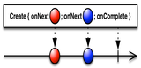

  

Some of the most common features of Groovy

* **[Closures] (src/main/impl/groovy/Closures.groovy)**

* **[Collections] (src/main/impl/groovy/Collections.groovy)**

* **[Delegates] (src/main/impl/groovy/Delegates.groovy)**
    
* **[Implicits] (src/main/impl/groovy/Implicits.groovy)**

* **[Memorize] (src/main/impl/groovy/Memorize.groovy)**

* **[Switch] (src/main/impl/groovy/Switch.groovy)**

* **[With] (src/main/impl/groovy/With.groovy)**

* **[Composition] (src/main/impl/groovy/Composition.groovy)**

* **[Annotation] (src/main/impl/groovy/Implicits.groovy)**
    * [Bindables] (src/main/impl/groovy/annotation/Bindables.groovy)
    * [Canonicals] (src/main/impl/groovy/annotation/Canonicals.groovy)
    * [DynamicTyping] (src/main/impl/groovy/annotation/DynamicTyping.groovy)

Some features of Reactive Groovy

 

* **Creating**

    
    * [Create] (src/main/impl/rx/Creation/Creational.groovy)

